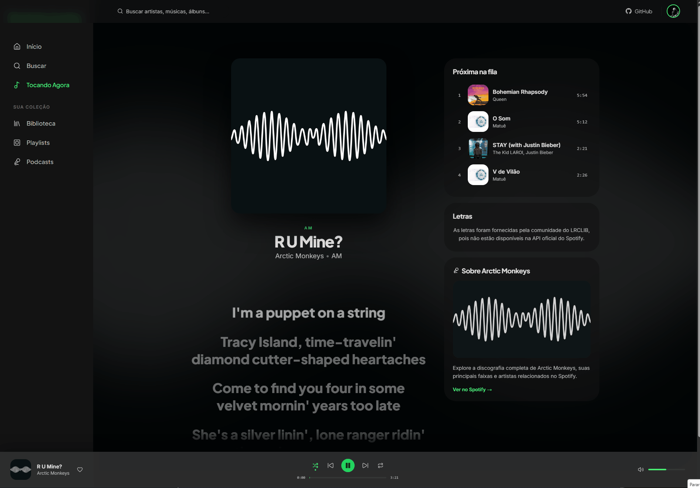

# 🎵 Spotify Profile Viewer

> **Seu perfil musical. Seus dados. Seu player de música**
> Uma SPA React que conecta diretamente à Spotify Web API e expõe tudo o que define o seu gosto musical — artistas, faixas, playlists, biblioteca e player de música completo.


---

## 🎬 Vídeo de Demonstração

[](https://www.youtube.com/watch?v=VZWszrKgeuU)

---

## 📖 Sobre o Projeto

**Spotify Profile Viewer** é uma Single Page Application que autentica o usuário via **OAuth 2.0 com PKCE** e consome exclusivamente os endpoints `/me` da Spotify Web API — sem backend próprio, sem segredos expostos, sem dependências de servidor.

O projeto nasceu como um exercício de design system fiel (extraído do Figma) e de arquitetura frontend moderna: autenticação stateless com refresh automático, cache inteligente via React Query, suporte a playback real pelo Web Playback SDK (usuários Premium) e um sistema de mock completo para desenvolvimento sem tocar na API.

**Por que é interessante?**
- Toda a autenticação roda 100% no browser com PKCE — sem `client_secret` em lugar nenhum
- O player funciona de verdade para usuários Premium (SDK nativo do Spotify)
- Letras sincronizadas em tempo real via [lrclib.net](https://lrclib.net)
- Design system completo com tokens CSS extraídos do Figma original

---

## ✨ Principais Funcionalidades

- **Autenticação OAuth 2.0 + PKCE** — Login seguro sem backend, com proteção CSRF via `state` e silent refresh automático
- **Perfil completo** — Avatar, nome, contagem de seguidores, artistas e faixas mais ouvidos
- **Top Artists & Top Tracks** — Grade responsiva (scroll horizontal no mobile, grid no desktop)
- **Minhas Playlists** — Listagem com destaque para a primeira playlist, filtro por criadas pelo usuário
- **Biblioteca** — Tracks recentes, artistas seguidos e álbuns salvos com busca integrada
- **Podcasts** — Shows salvos com link direto para o Spotify Web
- **Player completo (Premium)** — Play/pause, próximo, anterior, shuffle, repeat e controle de volume via Web Playback SDK
- **Letras sincronizadas** — Integração com lrclib.net na PlayerPage, synced com o tempo de reprodução
- **Modo Real Audio** — Variável `VITE_ENABLE_REAL_AUDIO=true` para habilitar controles de playback e streaming real via Web Playback SDK
- **Modo mock** — Variável `VITE_USE_MOCK=true` para desenvolvimento offline sem a API real
- **Totalmente responsivo** — Mobile-first com breakpoint em 768px; sidebar no desktop, bottom nav no mobile
- **Cache inteligente** — React Query com staleTime de 5min e gcTime de 30min

---

## 🔌 Endpoints da API Utilizados

Todos os endpoints são do escopo `/me` da Spotify Web API v1.

| Endpoint | Hook | Dados retornados |
|----------|------|-----------------|
| `GET /me` | `useProfile` | Nome, avatar, total de playlists |
| `GET /me/top/artists` | `useTopArtists` | Top 10 artistas (nome, imagem, gêneros) |
| `GET /me/top/tracks` | `useTopTracks` | Top 10 faixas (título, artista, álbum, duração) |
| `GET /me/playlists` | `usePlaylists` | Playlists do usuário (nome, capa, total de faixas) |
| `GET /me/player/recently-played` | `useRecentlyPlayed` | Histórico de reprodução recente |
| `GET /me/following?type=artist` | `useFollowedArtists` | Artistas seguidos |
| `GET /me/albums` | `useSavedAlbums` | Álbuns salvos na biblioteca |
| `GET /me/shows` | `useSavedShows` | Podcasts/shows salvos |
| `GET /me/player` | `usePlaybackState` | Estado atual do player (faixa, progresso, dispositivo) |
| `GET /me/player/queue` | `useQueue` | Fila de reprodução (próximas faixas) |
| `PUT /me/player/play` | `PlayerContext` | Iniciar/retomar reprodução (Premium) |
| `PUT /me/player/pause` | `PlayerContext` | Pausar reprodução (Premium) |
| `POST /me/player/next` | `PlayerContext` | Pular para próxima faixa (Premium) |
| `POST /me/player/previous` | `PlayerContext` | Voltar faixa (Premium) |
| `PUT /me/player/shuffle` | `PlayerContext` | Ativar/desativar shuffle (Premium) |
| `PUT /me/player/repeat` | `PlayerContext` | Alternar modo repeat (Premium) |
| `PUT /me/player/volume` | `PlayerContext` | Ajustar volume (Premium) |

### API externa — Letras (lrclib.net)

| Endpoint | Hook | Dados retornados |
|----------|------|-----------------|
| `GET https://lrclib.net/api/get?track_name=...&artist_name=...` | `useLyrics` | Letras sincronizadas em formato LRC, parseadas para `{ timeMs, text }[]` |

As letras são sincronizadas em tempo real com o progresso da música tocando: cada linha é destacada automaticamente no momento exato em que deve ser cantada, com scroll suave acompanhando a reprodução.



> Sem autenticação. Cache infinito (`staleTime: Infinity`, `gcTime: 1h`). Falhas retornam array vazio — a PlayerPage renderiza normalmente sem letras.

---


## ✅ Pré-requisitos

- **Node.js** >= 18 (recomendado 20 LTS)
- **npm** >= 9
- **Conta Spotify** (Free ou Premium — player completo requer Premium)
- **Aplicativo registrado no [Spotify Developer Dashboard](https://developer.spotify.com/dashboard)**

### Configuração do app no Spotify Dashboard

1. Acesse o Dashboard e crie um novo app
2. Em **Redirect URIs**, adicione: `http://127.0.0.1:5173/callback`
3. Salve o **Client ID** — você vai precisar dele nas variáveis de ambiente

---

## 🚀 Como Rodar o Projeto

```bash
# 1. Clone o repositório
git clone https://github.com/seu-usuario/spotify-profile-viewer.git
cd spotify-profile-viewer

# 2. Instale as dependências
npm install

# 3. Configure as variáveis de ambiente
cp .env.example .env
# Edite o .env com seu CLIENT_ID (veja a seção abaixo)

# 4. Inicie o servidor de desenvolvimento
npm run dev
```

Acesse **http://127.0.0.1:5173** no browser.

> **Atenção:** use `127.0.0.1` e não `localhost` — o Spotify valida a URI de redirect exatamente como cadastrada no Dashboard.

### Outros comandos

```bash
# Build de produção
npm run build

# Pré-visualizar o build de produção
npm run preview

# Lint
npm run lint
```

---

## 🔑 Variáveis de Ambiente

Crie um arquivo `.env` na raiz do projeto com as seguintes variáveis:

```env
VITE_SPOTIFY_CLIENT_ID=seu_client_id_aqui
VITE_SPOTIFY_REDIRECT_URI=http://127.0.0.1:5173/callback
VITE_USE_MOCK=false
VITE_ENABLE_REAL_AUDIO=false
```

| Variável | Obrigatória | Descrição |
|----------|-------------|-----------|
| `VITE_SPOTIFY_CLIENT_ID` | ✅ Sim | Client ID do seu app no Spotify Developer Dashboard |
| `VITE_SPOTIFY_REDIRECT_URI` | ✅ Sim | URI de callback após login. Deve estar cadastrada no Dashboard |
| `VITE_USE_MOCK` | ❌ Não | `true` para usar dados mockados localmente sem a API real |
| `VITE_ENABLE_REAL_AUDIO` | ❌ Não | `false` (padrão) ativa o **Modo Portfólio**: sem PlayerBar, sem botões de play, PlayerPage somente leitura. `true` ativa o **Modo Real**: scopes de streaming completos + Web Playback SDK (requer conta Premium) |

> **Segurança:** todas as variáveis `VITE_*` são embutidas no bundle de build. Nunca coloque `client_secret` aqui — este projeto propositalmente não usa client_secret (fluxo PKCE).

---

# 🛠️ Tecnologias Utilizadas

| Camada | Tecnologia | Versão |
|--------|-----------|--------|
| **Framework UI** | React | 19 |
| **Linguagem** | TypeScript | ~6.0 |
| **Build** | Vite | 8 |
| **Roteamento** | React Router DOM | 7 |
| **Data fetching / cache** | TanStack React Query | 5 |
| **Ícones** | Lucide React | 1.8 |
| **Estilização** | CSS Modules + CSS Custom Properties | — |
| **Fontes** | Plus Jakarta Sans, Inter, Liberation Mono | — |
| **Auth** | OAuth 2.0 PKCE (browser-only) | — |
| **Player** | Spotify Web Playback SDK | — |
| **Letras** | lrclib.net (API pública) | — |

---

## 🗂️ Arquitetura / Estrutura de Pastas

```
src/
├── auth/                    # Tudo relacionado a autenticação
│   ├── AuthContext.tsx      # Provider com estado global de auth (token, isLoading, isAuthenticated)
│   ├── config.ts            # CLIENT_ID, REDIRECT_URI, escopos OAuth
│   ├── pkce.ts              # Geração de code_verifier, code_challenge e state (crypto nativo)
│   ├── spotify-auth.ts      # login(), handleCallback(), refreshAccessToken(), logout()
│   └── token-store.ts       # Leitura/escrita de tokens no localStorage com controle de expiração
│
├── api/                     # Wrappers por endpoint da Spotify API
│   ├── profile.ts           # GET /me
│   ├── top.ts               # GET /me/top/artists e /me/top/tracks
│   ├── playlists.ts         # GET /me/playlists
│   ├── recentlyPlayed.ts    # GET /me/player/recently-played
│   ├── following.ts         # GET /me/following
│   ├── savedAlbums.ts       # GET /me/albums
│   ├── savedShows.ts        # GET /me/shows
│   ├── player.ts            # GET/PUT /me/player (controles de playback)
│   └── queryKeys.ts         # Chaves de cache centralizadas do React Query
│
├── services/
│   └── spotify-client.ts    # fetchWithAuth: retry 401, rate-limit 429, modo mock
│
├── contexts/
│   └── PlayerContext.tsx    # Estado do player, SDK initialization, optimistic updates
│
├── config/
│   └── featureFlags.ts      # Feature flags derivados de variáveis de ambiente (ENABLE_REAL_AUDIO)
│
├── hooks/                   # Um hook por endpoint + hooks de utilidade
│   ├── useSpotifyAuth.ts    # Acessa AuthContext
│   ├── useProfile.ts        # → useQuery(['profile'])
│   ├── useTopArtists.ts     # → useQuery(['top-artists'])
│   ├── useTopTracks.ts      # → useQuery(['top-tracks'])
│   ├── usePlaylists.ts      # → useQuery(['playlists'])
│   ├── useRecentlyPlayed.ts # → useQuery(['recently-played'])
│   ├── useFollowedArtists.ts# → useQuery(['followed-artists'])
│   ├── useSavedAlbums.ts    # → useQuery(['saved-albums'])
│   ├── useSavedShows.ts     # → useQuery(['saved-shows'])
│   ├── usePlaybackState.ts  # → useQuery(['player']) com polling a cada 5s (Premium)
│   ├── useQueue.ts          # → useQuery(['queue'])
│   ├── useLyrics.ts         # Busca e parseia letras sincronizadas via lrclib.net (LRC → ms)
│   └── useMediaQuery.ts     # useIsDesktop() — breakpoint 768px
│
├── pages/                   # Componentes de rota (um por página)
│   ├── LoginPage.tsx        # Tela de entrada com botão de login
│   ├── CallbackPage.tsx     # Troca o code pelo token e redireciona
│   ├── ProfilePage.tsx      # Dashboard principal (hero + top artists + top tracks)
│   ├── PlaylistsPage.tsx    # Lista de playlists com featured card
│   ├── LibraryPage.tsx      # Biblioteca com tabs e busca
│   ├── PlayerPage.tsx       # Player fullscreen com letras sincronizadas
│   └── PodcastsPage.tsx     # Shows/podcasts salvos
│
├── components/
│   ├── layout/              # Shell da aplicação (AppLayout, AppHeader, Sidebar, BottomNav, PlayerBar)
│   ├── profile/             # Componentes da tela de perfil (ProfileHero, ArtistCard, TrackItem...)
│   └── shared/              # LoadingState, ErrorState, EqualizerLoader
│
├── mocks/
│   └── spotify-data.ts      # Dados estáticos para modo VITE_USE_MOCK=true
│
├── types/
│   └── spotify.ts           # Interfaces TypeScript dos responses da API
│
├── styles/
│   └── tokens.css           # Todas as CSS Custom Properties (cores, tipografia, espaçamentos)
│
├── utils/
│   └── isPremiumUser.ts     # Helper para verificar se o usuário é Premium
│
└── index.css                # Reset global + animações (spin, equalizer)
```

**Padrão de dados:** página → hook → `fetchWithAuth` → Spotify API → React Query cache → componente re-renderiza. Nenhum componente faz fetch direto.

---


## 🧩 Desafios Técnicos Superados

### 1. Autenticação stateless com refresh token transparente

Implementar PKCE sem backend exige cuidado: o `code_verifier` precisa sobreviver ao redirect para o Spotify e voltar, o `state` precisa ser validado contra CSRF, e o refresh token precisa ser persistido de forma segura no localStorage com controle de expiração. O `token-store.ts` gerencia expiração com buffer de 30 segundos, e o `refreshAccessToken()` em `spotify-auth.ts` usa uma promise singleton para evitar múltiplas requisições de refresh simultâneas (problema clássico em SPAs com múltiplos hooks disparando ao mesmo tempo).

### 2. Dois modos de operação com um único flag

O projeto distingue **Modo Portfólio** (`VITE_ENABLE_REAL_AUDIO=false`, padrão) de **Modo Real** (`=true`). No Modo Portfólio, os scopes de streaming não são solicitados, a PlayerBar é ocultada e a PlayerPage funciona em modo somente leitura — ideal para demonstração sem conta Premium. No Modo Real, o `PlayerContext` inicializa o Spotify Web Playback SDK e registra o browser como dispositivo de reprodução; como o SDK exige Premium, as actions de controle são desabilitadas para usuários Free com feedback visual claro, sem erros silenciosos. A separação leitura/controle (`usePlaybackState` vs `PlayerContext`) garante que o estado atual do player é visível para qualquer usuário, independente do modo.

### 3. Design system fiel via CSS Custom Properties

Em vez de usar uma biblioteca de UI, todo o design foi implementado a partir de tokens extraídos do Figma (cores, tipografia, espaçamentos, glassmorphism) em `tokens.css`. Isso permitiu criar componentes pixel-perfect usando CSS Modules sem overhead de runtime, com fallbacks para navegadores sem suporte a `backdrop-filter`.

---

## 🤝 Como Contribuir

1. Faça um fork do repositório
2. Crie uma branch para sua feature: `git checkout -b feat/minha-feature`
3. Commit suas mudanças: `git commit -m 'feat: adicionar X'`
4. Push para a branch: `git push origin feat/minha-feature`
5. Abra um Pull Request

---

## 📄 Licença

Este projeto está sob a licença MIT.

---

<p align="center">
  Feito com React, TypeScript e muita música 🎧
</p>
